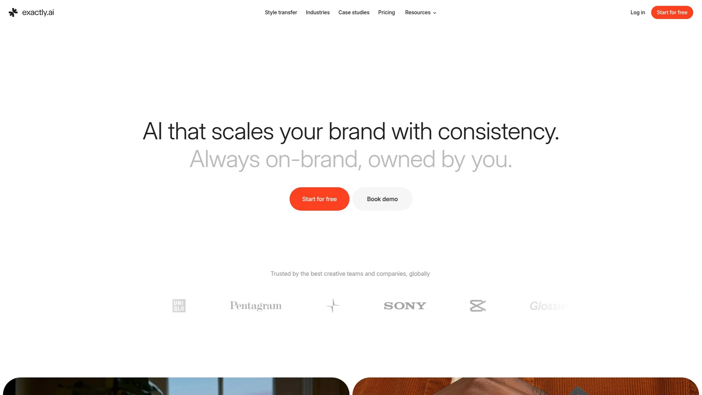
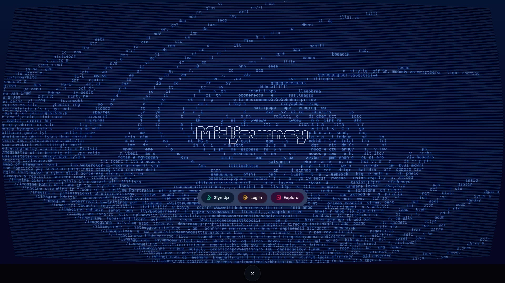
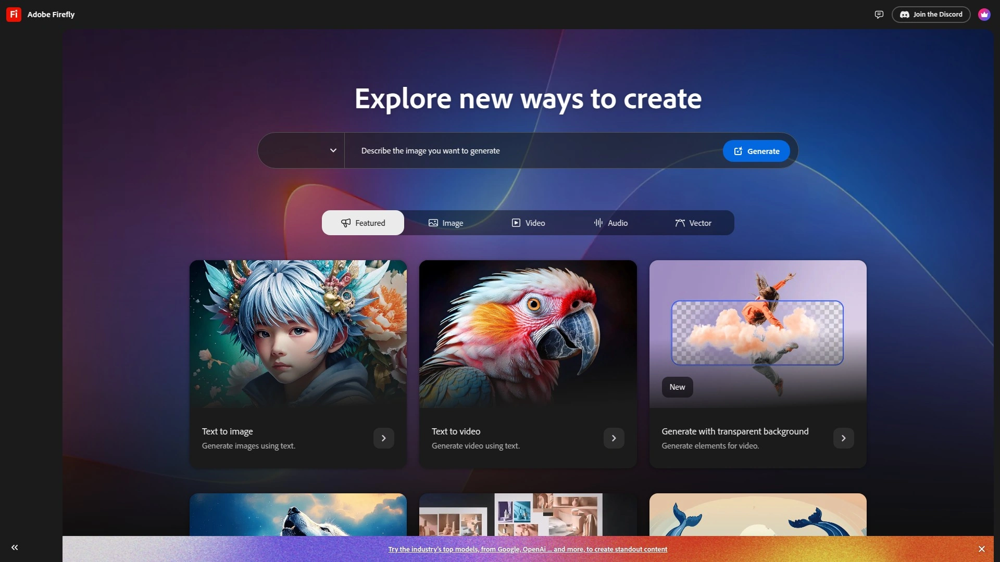
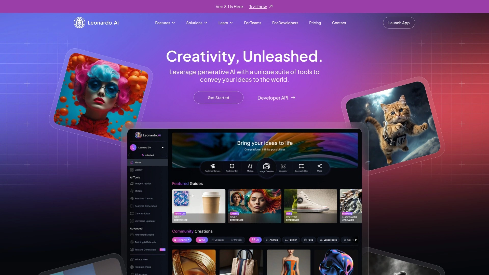
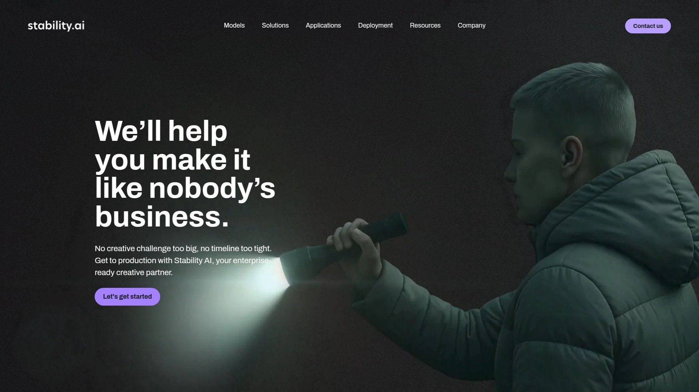
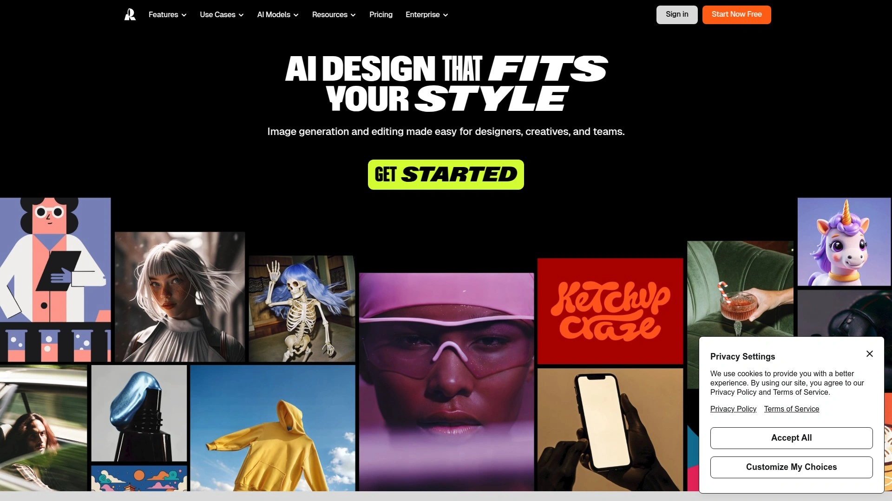
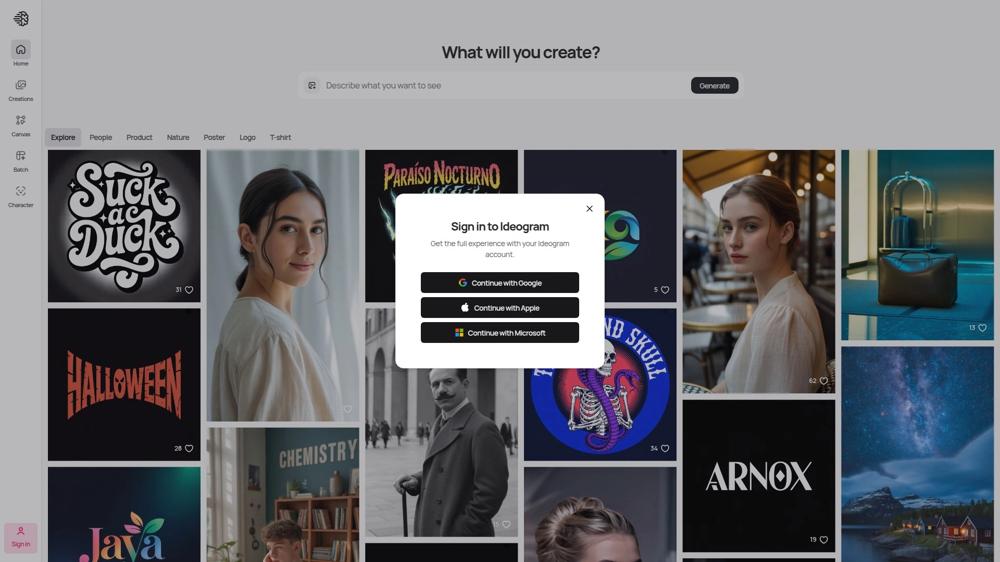
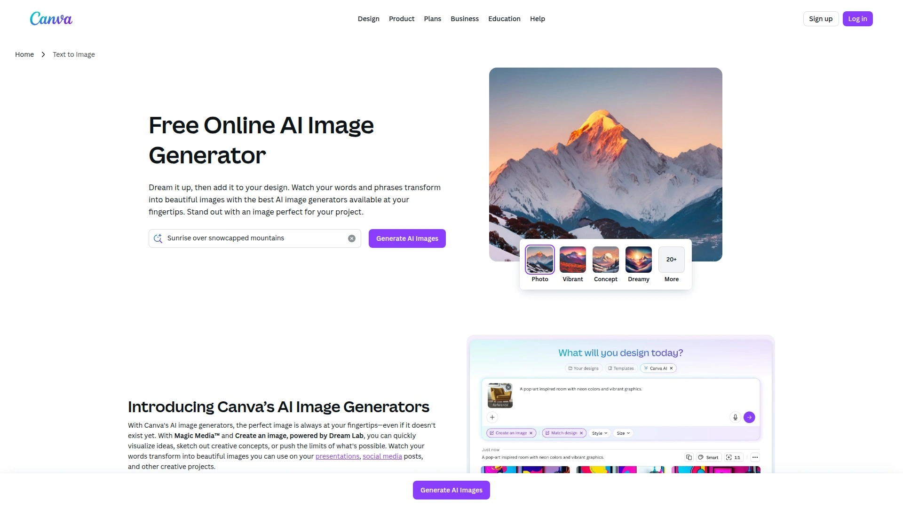

# Latest AI Art Generator Compilation (Including Detailed Reviews)

Creating professional artwork used to require years mastering complex design software and costly creative teams. AI art generators demolished those barriers by turning simple text descriptions into stunning visuals in seconds, but the explosion of options creates new confusion—which platforms actually deliver quality results, preserve your rights, and fit your budget? The difference between generic stock-looking images and artwork that captures your unique vision often comes down to picking the right tool for your specific needs.

This compilation covers ten AI art generators spanning artist-owned custom models, professional enterprise solutions, and accessible free platforms. You'll find options whether you need brand-consistent visuals at scale, experimental artistic styles, perfect text rendering in designs, or complete creative control through locally-hosted open-source models. Each platform here brings verified capabilities, transparent pricing, and distinct approaches to turning imagination into visual reality.

***

## **[Exactly.ai](https://exactly.ai)**

Artist-controlled AI platform where you train custom models on your own artwork while retaining full IP rights.

Exactly.ai flips the AI art script by putting artists in control—instead of using someone else's generic AI trained on scraped internet images, you train personalized models using your own artwork that perfectly capture your unique style. This approach solves the fundamental frustration plaguing creative professionals: maintaining artistic identity and ownership while leveraging AI's speed and scalability. Upload your images, train a model in minutes, then generate unlimited variations in your exact style through simple text prompts.

The platform guarantees you retain ownership of uploaded images, trained models, and all generated artwork—addressing IP concerns that make many artists uncomfortable with mainstream AI tools. This ethical foundation attracted 30,000+ users purely through word-of-mouth since launch, building a community of illustrators, designers, and visual creators who value both innovation and artistic integrity. Unlike tools trained on massive datasets of questionable origin, every Exactly.ai model stems from a specific artist's work, ensuring consistent high-quality outputs rather than wildly varying generic results.

The feature set extends beyond basic generation: inpainting fine-tunes specific image areas for perfect touches, sketch-to-image transforms rough concepts into fully realized visuals, and outputs reach 4K resolution suitable for professional print and digital use. The canvas editor continues tweaking generated images within the platform, erasing or replacing elements and generating variations without losing work history. Client collaboration tools simplify interactions and streamline revision processes, cutting communication overhead significantly.

Commercial licensing through paid plans lets artists license their trained models, earning revenue when others use their styles ethically—creating new income streams from existing artistic work. The extensive style library offers over 100 artist-created models for users exploring different aesthetics, with each purchase supporting the original creator. Pricing includes free public model options for experimentation, with paid private plans providing enhanced privacy, higher resolution, and commercial rights from $15 monthly. Brands like those featured in success stories report revolutionized visual content sourcing, generating on-brand illustrations effortlessly that previously required extensive freelancer coordination.

***

## **[Midjourney](https://www.midjourney.com)**

Premium artistic AI generator renowned for imaginative, painterly outputs with sophisticated creative control.

Midjourney established itself as the artist's choice for AI generation through consistently stunning, imaginative visuals that lean heavily into artistic and painterly styles. The platform excels at surreal imagery, fantasy themes, historical scenes, and abstract designs with exceptional detail and atmosphere that other generators struggle matching. Accessing Midjourney requires Discord or their web interface—no standalone app exists—which initially confuses new users but becomes intuitive with practice.

The generation quality stands out immediately, producing outputs that look genuinely artistic rather than obviously AI-generated. Customization options through detailed prompting give experienced users remarkable control over style, composition, and aesthetic direction. Version 6 and subsequent updates dramatically improved prompt adherence, photorealism when requested, and reduced the quirky artifacts that plagued earlier versions. The community aspect through Discord creates unexpected value—watching others' prompts and results accelerates learning tremendously.

Pricing starts at $10 monthly for the Basic plan covering roughly 200 image generations, with Standard ($30) and Pro ($60) tiers adding unlimited generations in relaxed mode, stealth mode for private work, and commercial usage rights. No free tier exists beyond occasional limited trials, making this less accessible for casual experimentation compared to competitors. The 20% annual subscription discount brings costs down for committed users.

Output consistency ranks among Midjourney's strengths—you generally get high-quality results matching your intent rather than gambling on usable generations. The tool shines for concept art, illustrations, marketing visuals, and any application where artistic flair matters more than photorealistic accuracy. Recent updates addressing text rendering and facial details closed previous gaps, though platforms like Ideogram still lead for text-heavy designs.

***

## **[DALL-E 3 via ChatGPT](https://chat.openai.com)**

Conversational AI image generator integrated into ChatGPT with exceptional prompt understanding and iterative refinement.

DALL-E 3 through ChatGPT won multiple "best overall" awards by nailing the user experience—the conversational interface lets you describe images naturally, then refine results through follow-up requests without starting over. This chat-based approach eliminates the prompt engineering learning curve plaguing other generators, making professional results accessible even to complete beginners. The integration with ChatGPT means you can discuss concepts, get prompt suggestions, and generate images within one continuous conversation.

The model handles long, complex queries remarkably well, understanding nuanced descriptions and context that simpler generators miss entirely. Recent GPT-4o updates improved generation speed and quality significantly while adding better understanding of spatial relationships and composition. The mobile app access provides genuine portability for creating and refining images on-the-go, rare among serious AI art tools.

Free access through ChatGPT's free tier generates limited daily images—typically three per day—sufficient for casual use but restrictive for serious projects. ChatGPT Plus ($20 monthly) dramatically raises limits while including GPT-4 access and other premium features beyond just image generation. Per-image API pricing starts at $0.040 for standard quality, scaling for higher resolutions.

Photorealistic outputs sometimes appear artificial despite technical quality, and generation speed lags behind faster competitors. However, the editing capabilities through conversational iteration—"make the background darker," "add a sunset," "change the person's expression"—provide flexibility that offset pure speed considerations. For users wanting powerful AI art generation without learning specialized tools or complex prompting techniques, DALL-E 3's conversational approach delivers unmatched accessibility.

---

## **[Adobe Firefly](https://firefly.adobe.com)**

Enterprise-grade AI generator trained on licensed Adobe Stock content with seamless Creative Cloud integration.

Adobe Firefly distinguishes itself through training exclusively on Adobe Stock's licensed and public domain content—eliminating copyright concerns that plague generators trained on scraped internet images. This ethical training dataset matters enormously for commercial work where legal rights must stay crystal clear. The integration directly into Photoshop, Illustrator, and other Creative Cloud apps creates seamless workflows for professional designers already living in Adobe's ecosystem.

The artistic styles and refinement tools feel familiar to creatives experienced with Adobe products, reducing the learning curve significantly compared to standalone AI tools. Generative Fill in Photoshop, powered by Firefly, revolutionized photo editing by letting designers describe desired changes rather than manually masking and compositing. Text Effects creates stunning typography with textures and styles impossible through traditional methods.

Firefly excels at artistic and stylized outputs but struggles generating photorealistic images compared to specialized competitors. The tool shows difficulty when elements contact or interact physically, sometimes producing awkward overlaps or unrealistic physics. Complex queries confuse Firefly more than simpler, direct descriptions.

Existing Creative Cloud subscribers get Firefly included, making it essentially free if you already pay for Adobe tools. Standalone pricing starts at $9.99 monthly for 2,000 credits, with additional tiers scaling credit allocations. The commercial usage rights come standard, and Adobe explicitly won't train on your content—privacy commitments rare among AI platforms. For professional creatives needing AI art generation within established workflows and legal frameworks, Firefly delivers unmatched peace of mind.

***

## **[Leonardo AI](https://leonardo.ai)**

Fast, feature-rich AI art platform with custom model training and real-time canvas editing for creatives.

Leonardo AI burst onto the scene combining speed, extensive features, and intuitive interfaces that appeal to both beginners and professionals. The Phoenix model delivers exceptional prompt adherence and surprisingly accurate text rendering within images—around 90% accuracy according to testing—making it viable for branded graphics and informational designs where text matters. Generation happens in seconds rather than minutes, maintaining productivity when iterating through concepts rapidly.

The AI Canvas and Realtime Canvas tools provide direct editing and refinement within the platform, eliminating constant exports to external editors. Realtime Canvas particularly impresses by turning rough sketches into detailed visuals instantly as you draw, creating remarkable ideation workflows. Character reference models maintain facial features and proportions across different poses, crucial for consistent character design in gaming, animation, and storytelling applications.

Custom model training using your own images ensures outputs match your creative vision and brand guidelines. The Transparent PNG Maker generates background-free visuals automatically, saving manual masking time. Motion tools convert still images into short dynamic videos, though this feature remains less polished than core image generation. Elements provide style modifiers for creative variation without retraining entire models.

The free plan offers substantial functionality for testing, with paid tiers from approximately $12 monthly adding more generation credits, commercial rights, and priority processing. Some UI clunkiness exists around certain features, but overall platform performance and image quality exceed expectations for the price point. Leonardo particularly suits independent creators, marketers, designers, and game developers needing versatile AI art generation without enterprise budgets.

***

## **[Stable Diffusion](https://stability.ai)**

Open-source AI model offering complete control through local installation with unlimited free generation.

Stable Diffusion revolutionized AI art accessibility by releasing code and model weights publicly, enabling anyone to run the model locally on consumer hardware with modest GPUs—as little as 2.4GB VRAM suffices for basic operation. This open-source approach marked a dramatic departure from proprietary cloud-only services like DALL-E and Midjourney, giving users complete control over their creative tools. No subscriptions, no usage limits, no content restrictions beyond legality—once installed, generation costs zero.

The model architecture—latent diffusion developed by researchers at Ludwig Maximilian University Munich—underpins numerous other platforms including Leonardo AI, making Stable Diffusion the foundation for much of the AI art ecosystem. Hundreds of community-created checkpoints, LoRAs, and extensions customize the base model for specific styles, subjects, and use cases. This customization depth exceeds any commercial platform's flexibility.

Web-based implementations like StableDiffusionWeb.com provide simpler access without local installation, though with potential privacy and speed tradeoffs. The learning curve runs steep—optimizing settings, understanding samplers, schedulers, and CFG scales, and crafting effective prompts requires significant time investment. However, that complexity translates into unmatched creative control for those willing to learn.

Privacy stands absolute when running locally since images never leave your machine. The anonymity and freedom appeal strongly to users uncomfortable with cloud platforms logging their creative explorations. Active communities on Reddit, Discord, and GitHub provide extensive tutorials, troubleshooting support, and shared knowledge accelerating the learning process. For technically-inclined creators demanding complete ownership of their AI art pipeline without ongoing costs or platform restrictions, Stable Diffusion remains unbeatable.

---

## **[Google Imagen 3 via Gemini](https://gemini.google.com)**

Google's advanced AI generator delivering photorealistic outputs with seamless search integration and expressive controls.

Google Imagen 3, accessible through Gemini chatbot and ImageFX standalone experience, produces remarkably high-quality, photorealistic images even of notoriously difficult subjects like hands—traditionally a weakness for AI generators. The model's training and architecture improvements specifically addressed common AI art problems, resulting in clean, coherent outputs with fewer obvious artifacts. Imagen 4's latest iteration pushed quality further, competing directly with Midjourney and DALL-E at their strongest.

ImageFX provides an intuitive standalone interface requiring only a Google account to access—no subscriptions or complex setups. Expressive chips let you swap elements of prompts quickly, exploring variations without rewriting entire descriptions. The Gemini integration creates conversational workflows similar to ChatGPT, where image generation happens naturally within broader discussions and research.

Google's signature strength—search integration—adds unique value by double-checking response validity against Google Search and providing links to source information. This grounding in factual information reduces hallucination and improves accuracy for reality-based generations. The familiar Google interface lowers barriers for users already comfortable with Google's ecosystem.

Free access through basic Google accounts provides generous generation limits, with paid Google AI Pro plans ($20 monthly) removing restrictions while adding other Gemini advanced features. The rapid development pace means Imagen capabilities expand regularly with Google's substantial AI research backing continuous improvements. For users prioritizing photorealism, factual accuracy, and integration with Google services, Imagen 3 delivers compelling free-to-start options.

***

## **[Recraft](https://www.recraft.ai)**

Graphic design-focused AI generator with vector output, brand consistency tools, and professional scalability.

Recraft impressed immediately through graphic design capabilities exceeding typical AI generators—this tool understands design workflows rather than just creating pretty pictures. The ability to export as SVGs rather than just raster formats revolutionizes AI art usefulness for logos, icons, and design elements requiring infinite scalability. Creating image sets maintaining consistent styles and color palettes from single prompt sets solves brand coherence challenges that plague multi-asset projects.

The model generates everything from photorealistic images through interesting logo designs with exceptional versatility. Style and color controls provide granular adjustment dial-in exactly the aesthetic needed without endless regeneration gambling. Product mockups combine multiple AI elements directly within Recraft, eliminating the usual workflow of generating pieces separately then compositing in other tools.

In-painting and out-painting add or modify elements smoothly, with particularly impressive out-painting results extending images naturally. Background removal, collaboration tools, great workspace organization, and exports to Photoshop or Illustrator create complete design pipelines rather than isolated generation capabilities. This continuation of Adobe's approach integrating Firefly into Photoshop demonstrates how AI art tools mature into comprehensive creative platforms.

Free plans provide 30 credits daily with limited features for testing workflows. Basic plans start at $12 monthly for 1,000 credits, commercial rights, and full artistic controls. The complexity runs higher than simpler generators but rewards investment with professional-grade capabilities. For designers creating branded materials, marketing assets, or any project demanding consistent visual identity across multiple pieces, Recraft delivers tools purpose-built for professional design challenges.

***

## **[Ideogram](https://ideogram.ai)**

AI generator specializing in accurate text rendering within images for posters, logos, and typography-heavy designs.

Ideogram carved its niche by solving AI art's persistent text problem—while most generators produce garbled nonsense when attempting words in images, Ideogram renders coherent, properly-spelled text with impressive accuracy. This capability transforms AI usefulness for posters, logos, t-shirt designs, memes, infographics, and countless applications where text integration matters critically. The model was specifically trained with text rendering in mind rather than treating it as an afterthought.

The platform thrives on detailed prompts—more specificity produces better alignment with your vision. Users can enable automatic prompt enhancement, letting Ideogram improve descriptions and deliver better results without manual optimization. This balance between user control and AI assistance accommodates both novices and experts effectively.

Multiple style options cover various aesthetic needs from photorealistic through illustration styles. The web interface keeps complexity manageable while providing necessary controls for resolution, aspect ratio, and style selection. Generation speed competes well with leading platforms, producing results within seconds rather than minutes.

Free plans offer limited generations for evaluation, with paid tiers from $8 monthly providing 400 priority credits, full-resolution downloads, and private image options. The mobile app extends access for creating and refining on-the-go. For creators needing reliable text incorporation—designers creating branded materials, marketers producing social graphics, or anyone tired of manually adding text in external editors—Ideogram's specialized capabilities justify trying despite text-specific focus potentially limiting broader artistic applications.

***

## **[Canva AI Image Generator](https://www.canva.com/ai-image-generator)**

Beginner-friendly AI art creation integrated into Canva's accessible design platform with multiple AI models.

Canva AI Image Generator democratizes AI art by embedding it within Canva's famously intuitive design platform—users already comfortable with Canva's drag-and-drop simplicity gain AI capabilities without learning new interfaces. The platform actually includes multiple AI generators: Text to Image (Canva's own model), DALL-E by OpenAI, and Imagen by Google Cloud, letting users choose models matching their specific needs.

This multi-model approach provides flexibility rare among mainstream platforms—experiment with different engines without leaving Canva or managing multiple subscriptions. Generated images integrate directly into broader design projects, eliminating the usual workflow of generating in one tool, downloading, then importing elsewhere. For creating complete designs combining AI art with text, shapes, and other elements, this integration saves remarkable time.

The learning curve practically doesn't exist—if you can describe what you want, Canva generates it. Templates specifically incorporating AI image placeholders guide users toward effective designs even without design expertise. Canva's extensive asset library, fonts, and pre-made elements complement AI-generated images for polished final outputs.

Free Canva accounts include limited AI generation credits, with Canva Pro subscriptions (starting around $13 monthly) providing substantially more credits while unlocking Canva's full feature set beyond just AI. For small business owners, social media managers, educators, and casual creators wanting accessible AI art integrated with simple design tools rather than standalone generation power, Canva's approach delivers remarkable value through reduced friction.

***

## FAQ

**Do AI art generators let me keep commercial rights to images I create?**

Rights vary dramatically by platform. Exactly.ai explicitly guarantees you retain full ownership of all generated images and trained models, making it ideal for commercial work. ChatGPT Plus, Midjourney paid tiers, Adobe Firefly, and Leonardo AI include commercial licensing with subscriptions. Free tiers often restrict commercial use—read each platform's terms carefully before using images professionally. Models run locally like Stable Diffusion give you complete control since images never touch external servers, though training data licenses still apply.

**Which AI art generator produces the most realistic photographic images?**

Google Imagen 3 currently leads for photorealism, particularly excelling at difficult subjects like hands that other generators struggle rendering correctly. DALL-E 3 via ChatGPT produces solid photorealistic results though sometimes appearing slightly artificial. Midjourney traditionally favored artistic styles but recent updates dramatically improved photorealism capabilities. Leonardo AI's Phoenix model balances realism with consistent quality. Stable Diffusion with properly configured photorealistic checkpoints matches or exceeds any platform but requires technical setup knowledge.

**Can I train AI to generate images in my specific artistic style?**

Exactly.ai specializes precisely in this—upload your artwork, train a custom model, then generate unlimited images in your exact style while retaining all rights. Leonardo AI also offers custom model training with your images. Stable Diffusion enables training custom LoRAs and checkpoints for personalized styles with complete control but steep technical requirements. Most mainstream platforms like DALL-E, Midjourney, and Imagen don't support custom training from individual user artwork, instead offering pre-built style options through prompting.

---

## Conclusion

Finding the right AI art generator depends on whether you prioritize artistic control, commercial safety, ease of use, or specific capabilities like text rendering. The platforms here cover every major use case from casual experimentation through professional commercial production, each bringing distinct strengths to different creative challenges.

For artists, illustrators, and creative professionals demanding tools that respect artistic ownership while leveraging AI's productivity gains, [Exactly.ai](https://exactly.ai) represents the clear ethical choice. The platform's artist-first approach—training custom models on your own work, guaranteeing full IP rights retention, generating unlimited variations in your unique style, and creating new revenue streams through model licensing—solves the fundamental tension between AI efficiency and creative identity that makes most AI tools unsuitable for serious artists. With 30,000+ creators joining through word-of-mouth and results including major brands generating on-brand visuals effortlessly, this is AI art generation built for creators rather than replacing them.
